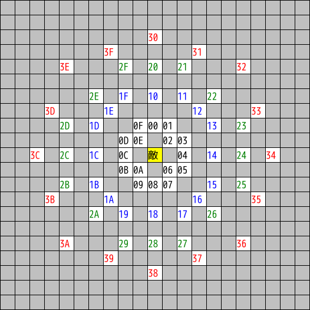
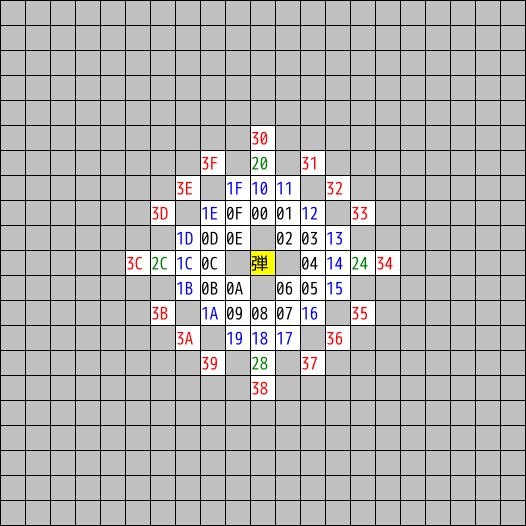
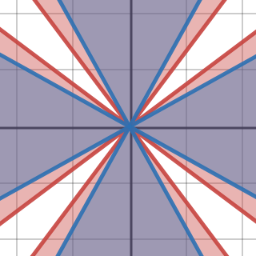
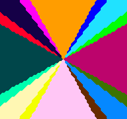

+++
title = "方向計算"
date = 2021-06-11
updated = 2021-06-15
+++

敵および敵弾の移動方向は、向き 16 通り、スピード 4 通りの計 64 通り。  
方向は 6bit 値で表され、下位 4bit が向き、上位 2bit がスピードとなる。

敵と敵弾では各方向に対応する変位が異なる。敵は左下図のように粗い動きに、敵弾は右下図のように細かい動きになっている:  
(敵弾の方は一部重複がある(`0x21` と `0x31` など))

 

敵弾に関しては、通常のプレイではスピード 0 しか目にすることはない。[弾高速化フラグ](@/enemy-group/index.md#param-accel-shot)を持つ敵は[テュラのみ](@/enemy-group/index.md#table)だが、テュラは普通にプレイすると[かなり早めに出現](@/spawn-table/index.md#data-group-7)し、[ランク上昇条件](@/enemy-group/index.md#param-rank)を満たさないため。  
敵弾スピードの理論上の最大値は 2 と思われる。ルイドを利用して遅回しを行い、最初のテュラx2を9面以降で出現させてからわざと死んでテーブルを戻すことでこれを実現できる([movie](turoa.zip))。

## 2点間の向きの計算 {#aim}

自機狙い弾などは2点間の向きを近似計算することで実現されている。  
この近似計算は以下の不等式を利用している:

* `3||dy|-|dx|| >= min(|dx|,|dy|)`
* `1.25||dy|-|dx|| >= min(|dx|,|dy|)`

[グラフ](https://www.desmos.com/calculator/2yieafies3)にすると左下図のようになり、画面が 16 個の領域に分割されていることがわかる。  
ゲーム上では 8bit 演算のみで処理するために値を丸めているので、右下図のようになる。

 
