+++
title = "オブジェクトID"
date = 2021-06-10
+++

ID 0 はオブジェクトが存在しないことを表す。  
ID 0x20 は欠番。

英名は [Star Soldier Wiki](https://star-soldier.fandom.com/wiki/Star_Soldier) を参照しつつ適当に付けた。

| ID   | 和名                 | 英名     | 画像                        |
| --   | --                   | --       | :-:                         |
| 0x01 | レウス               | Laos     |  |
| 0x02 | テュラ               | Turoa    |  |
| 0x03 | エイク               | Ake      | 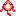 |
| 0x04 | ソレル               | Solad    | 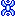 |
| 0x05 | ディダ               | Deda     |  |
| 0x06 | ペンド               | Pendo    | 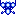 |
| 0x07 | リアード             | Leado    |  |
| 0x08 | バタフ               | Butterfu | 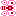 |
| 0x09 | スラント             | Sirant   | 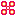 |
| 0x0A | カルゴ               | Kargo    |  |
| 0x0B | アトリス             | Auteriss |  |
| 0x0C | メルス               | Merisu   | 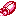 |
| 0x0D | プリング             | Pring    |  |
| 0x0E | ヤール               | Yarl     | 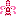 |
| 0x0F | ビーグ               | Beeq     | 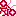 |
| 0x10 | メーバ               | Mayba    |  |
| 0x11 | ルイド               | Lewido   |  |
| 0x12 | ジェラ               | Jera     |  |
| 0x13 | ルダン               | Lydan    |  |
| 0x14 | リューク             | Luke     |  |
| 0x15 | ビータ               | Beta     |  |
| 0x16 | テミス               | Temess   | 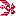 |
| 0x17 | パトラ               | Patera   | 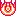 |
| 0x18 | ドラク               | Dorak    |  |
| 0x19 | プリズン             | Prizon   | 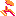 |
| 0x1A | カディス             | Kadiss   | 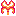 |
| 0x1B | ステリア             | Steria   |  |
| 0x1C | リーデ               | Leda     |  |
| 0x1D | グハ                 | Guha     | 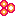 |
| 0x1E | ジェリコ             | Shidiko  |  |
| 0x1F | ラザロ               | Lazaro   |  |
| 0x21 | ソープラー           | Sopla    | 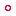 |
| 0x22 | スターブレインのコア |          |  |
| 0x23 | スターブレインの砲台 |          |  |
| 0x24 | パワーアップアイテム |          |  |
| 0x25 | 空中物の大爆発       |          |  |
| 0x26 | 地上物の大爆発       |          | 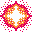 |
| 0x27 | 地上物の小爆発       |          |  |
| 0x28 | 空中物の小爆発       |          |  |

